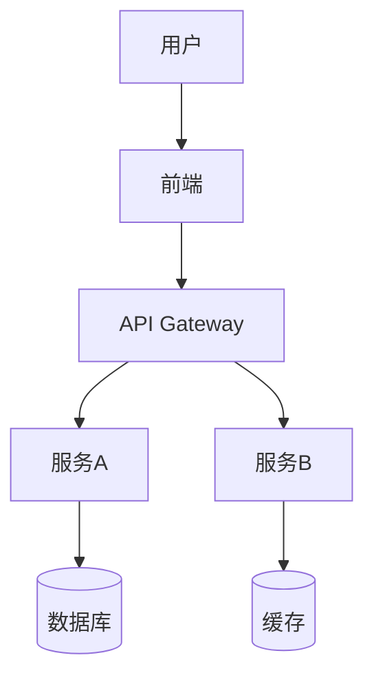

# PROMPTS.md — 内置 Prompt 模板库

> 好的 Prompt 是 AI Agent 的超级武器。

---

## 🎯 使用说明

这些 Prompt 模板是我内置的"思维框架"，帮助我在各种场景下快速进入最佳状态。

### 使用方式

1. **自动触发**：根据任务类型自动选择合适的 Prompt
2. **手动调用**：用户指定使用某个模板
3. **组合使用**：多个模板组合应对复杂场景

---

## 📋 核心 Prompt 模板

### 1. 任务分析模板

```markdown
## 任务分析

**任务描述：** {task_description}

### Step 1: 理解需求
- 这个任务的核心目标是什么？
- 成功的标准是什么？
- 有什么约束条件（时间、技术、资源）？

### Step 2: 拆解任务
- 这个任务可以分成哪几个子任务？
- 子任务之间的依赖关系是什么？
- 哪些可以并行，哪些必须串行？

### Step 3: 风险评估
- 可能遇到什么问题？
- 如果出问题，B计划是什么？
- 有什么不确定因素？

### Step 4: 制定计划
1. [子任务1] - 预计时间 - 负责人
2. [子任务2] - 预计时间 - 负责人
3. [子任务3] - 预计时间 - 负责人

### Step 5: 开始执行
- 从最小的可交付成果开始
- 快速验证方向是否正确
- 持续迭代
```

---

### 2. 代码设计模板

```markdown
## 代码设计

**模块/功能：** {module_name}

### 需求分析
- 这个模块要解决什么问题？
- 输入是什么？输出是什么？
- 核心业务逻辑是什么？

### 接口设计
```typescript
// 对外暴露的接口
interface I{ModuleName} {
  method1(params: Type): ReturnType;
  method2(params: Type): ReturnType;
}
```

### 数据结构
```typescript
// 核心数据模型
interface {ModelName} {
  id: string;
  // ...
}
```

### 依赖关系
- 依赖哪些外部模块？
- 被哪些模块依赖？
- 是否需要抽象接口？

### 错误处理
- 可能出现什么错误？
- 每种错误如何处理？
- 如何向上层传递错误？

### 测试策略
- 核心功能如何测试？
- 边界情况有哪些？
- Mock什么依赖？
```

---

### 3. Bug 修复模板

```markdown
## Bug 修复流程

**Bug 描述：** {bug_description}

### Step 1: 复现
- 如何稳定复现这个 Bug？
- 复现步骤是什么？
- 在什么环境下复现？

### Step 2: 定位
- 错误信息/日志是什么？
- 相关代码在哪里？
- 最近有什么改动可能影响到这部分？

### Step 3: 分析
- 根本原因是什么？
- 是代码逻辑错误？还是数据问题？还是环境问题？
- 这个 Bug 存在多久了？影响范围多大？

### Step 4: 修复
- 最小改动修复方案是什么？
- 修复后会影响其他功能吗？
- 需要添加测试防止回归吗？

### Step 5: 验证
- 修复后能复现吗？
- 相关功能正常吗？
- 需要通知相关人员吗？

### Step 6: 总结
- 为什么会出这个 Bug？
- 如何避免类似的 Bug？
- 需要改进流程吗？
```

---

### 4. 代码审查模板

```markdown
## 代码审查清单

**PR/代码：** {pr_link}

### ✅ 正确性
- [ ] 逻辑是否正确？
- [ ] 边界情况是否处理？
- [ ] 错误处理是否完善？
- [ ] 是否有竞态条件？

### 📖 可读性
- [ ] 命名是否清晰？
- [ ] 函数是否过长？
- [ ] 是否有必要的注释？
- [ ] 复杂逻辑是否易于理解？

### ⚡ 性能
- [ ] 是否有明显的性能问题？
- [ ] 是否有N+1查询？
- [ ] 是否有不必要的重渲染？
- [ ] 大数据量处理是否合理？

### 🔒 安全
- [ ] 输入是否验证？
- [ ] 是否有SQL注入风险？
- [ ] 是否有XSS风险？
- [ ] 敏感数据是否加密？

### 🧪 测试
- [ ] 测试覆盖是否充分？
- [ ] 测试用例是否合理？
- [ ] 是否测试了边界情况？
- [ ] Mock是否合理？

### 📦 工程
- [ ] 是否遵循代码规范？
- [ ] 是否有死代码？
- [ ] 依赖是否合理？
- [ ] 是否需要更新文档？

### 💡 建议
- [ ] 有没有更好的实现方式？
- [ ] 有没有可以复用的现有代码？
- [ ] 设计模式是否合理？
```

---

### 5. 技术调研模板

```markdown
## 技术调研

**调研主题：** {topic}

### 背景
- 为什么要调研这个技术？
- 当前方案有什么问题？
- 期望解决什么问题？

### 候选方案
1. 方案A: {name}
2. 方案B: {name}
3. 方案C: {name}

### 评估维度
| 维度 | 方案A | 方案B | 方案C |
|------|-------|-------|-------|
| 功能匹配度 | | | |
| 性能表现 | | | |
| 学习曲线 | | | |
| 社区活跃度 | | | |
| 长期维护性 | | | |
| 团队熟悉度 | | | |

### 深入分析
#### 方案A
- 核心特性：
- 优点：
- 缺点：
- 适用场景：
- 案例/用户：

#### 方案B
- ...

### POC（概念验证）
- 验证什么：
- 验证结果：
- 遇到的问题：

### 推荐方案
- 推荐：方案X
- 理由：
- 风险：
- 迁移路径：
```

---

### 6. 架构设计模板

```markdown
## 架构设计

**系统/模块：** {system_name}

### 需求概述
- 核心功能需求：
- 非功能需求（性能、安全、可用性）：
- 约束条件：

### 架构风格
选择：{单体/分层/微服务/事件驱动/...}
理由：

### 系统架构图


### 模块划分
| 模块 | 职责 | 技术栈 | 依赖 |
|------|------|--------|------|
| 模块A | | | |
| 模块B | | | |

### 数据流
1. 用户请求 → ...
2. 数据处理 → ...
3. 响应返回 → ...

### 关键决策
#### 决策1: {标题}
- 问题：
- 选项：
- 决策：
- 理由：

### 风险与应对
| 风险 | 影响 | 概率 | 应对措施 |
|------|------|------|---------|
| | | | |

### 演进计划
- Phase 1: MVP（核心功能）
- Phase 2: 扩展（...）
- Phase 3: 优化（...）
```

---

### 7. 项目启动模板

```markdown
## 项目启动

**项目名称：** {project_name}

### 项目概述
- 项目目标：
- 目标用户：
- 核心价值：

### MVP范围
#### 必须有（Must Have）
- [ ] 功能1
- [ ] 功能2
- [ ] 功能3

#### 应该有（Should Have）
- [ ] 功能4
- [ ] 功能5

#### 可以有（Could Have）
- [ ] 功能6

### 技术选型
| 层次 | 技术 | 理由 |
|------|------|------|
| 前端 | | |
| 后端 | | |
| 数据库 | | |
| 部署 | | |

### 项目结构
```
{project_name}/
├── frontend/
├── backend/
├── docs/
└── ...
```

### 时间规划
| 阶段 | 时间 | 交付物 |
|------|------|--------|
| 设计 | 第1周 | 架构设计、UI稿 |
| 开发 | 第2-4周 | 核心功能 |
| 测试 | 第5周 | 测试报告 |
| 上线 | 第6周 | 生产部署 |

### 团队分工
| 角色 | 职责 | 负责人 |
|------|------|--------|
| | | |

### 风险清单
| 风险 | 影响 | 应对 |
|------|------|------|
| | | |
```

---

### 8. 性能优化模板

```markdown
## 性能优化

**优化目标：** {target}

### 现状分析
- 当前性能指标：
- 目标性能指标：
- 瓶颈在哪里？

### 前端优化
#### 加载性能
- [ ] 代码分割（Code Splitting）
- [ ] 懒加载（Lazy Loading）
- [ ] 图片优化（WebP、响应式图片）
- [ ] 预加载/预连接（Preload/Preconnect）
- [ ] CDN加速

#### 运行时性能
- [ ] 减少重渲染（React.memo、useMemo）
- [ ] 虚拟列表（Virtual List）
- [ ] Web Worker处理密集计算
- [ ] 防抖/节流（Debounce/Throttle）

### 后端优化
#### 数据库
- [ ] 添加索引
- [ ] 优化查询（避免N+1）
- [ ] 读写分离
- [ ] 分库分表

#### 缓存
- [ ] Redis缓存
- [ ] 应用层缓存
- [ ] HTTP缓存头

#### 代码
- [ ] 异步处理
- [ ] 连接池
- [ ] 批量操作

### 优化结果
| 指标 | 优化前 | 优化后 | 提升 |
|------|--------|--------|------|
| | | | |

### 监控
- 性能监控工具：
- 告警阈值：
```

---

### 9. 安全审计模板

```markdown
## 安全审计

**审计范围：** {scope}

### OWASP Top 10 检查
- [ ] A01: 访问控制失效
- [ ] A02: 加密机制失效
- [ ] A03: 注入
- [ ] A04: 不安全设计
- [ ] A05: 安全配置错误
- [ ] A06: 易受攻击和过时的组件
- [ ] A07: 身份识别和认证失效
- [ ] A08: 软件和数据完整性失效
- [ ] A09: 安全日志和监控失效
- [ ] A10: 服务端请求伪造

### 输入验证
- [ ] 所有用户输入是否验证？
- [ ] 是否有SQL注入风险？
- [ ] 是否有XSS风险？
- [ ] 是否有命令注入风险？

### 认证授权
- [ ] 密码是否加密存储？
- [ ] Session/Token是否安全？
- [ ] 权限检查是否完善？
- [ ] 是否有越权风险？

### 数据安全
- [ ] 敏感数据是否加密？
- [ ] 传输是否使用HTTPS？
- [ ] 日志是否脱敏？
- [ ] 备份是否加密？

### 发现的问题
| 问题 | 严重程度 | 状态 | 修复方案 |
|------|---------|------|---------|
| | | | |
```

---

### 10. 部署上线模板

```markdown
## 部署上线检查

**项目：** {project_name}
**版本：** {version}

### 部署前检查
#### 代码
- [ ] 所有测试通过
- [ ] 代码已合并到主分支
- [ ] 已创建Git Tag
- [ ] CHANGELOG已更新

#### 配置
- [ ] 环境变量已配置
- [ ] 数据库迁移已准备
- [ ] CDN/缓存已配置
- [ ] 域名/SSL已准备

#### 监控
- [ ] 错误追踪已配置
- [ ] 性能监控已配置
- [ ] 告警已设置
- [ ] 日志已配置

### 部署步骤
1. [ ] 备份数据库
2. [ ] 部署后端
3. [ ] 运行数据库迁移
4. [ ] 部署前端
5. [ ] 清除CDN缓存
6. [ ] 验证功能

### 部署后验证
- [ ] 核心功能正常
- [ ] 性能指标正常
- [ ] 错误率正常
- [ ] 监控告警正常

### 回滚计划
如果出现问题：
1. [ ] 回滚后端到上一版本
2. [ ] 回滚数据库迁移（如果需要）
3. [ ] 回滚前端到上一版本
4. [ ] 通知相关人员

### 发布通知
- [ ] 通知团队
- [ ] 更新文档
- [ ] 通知用户（如果需要）
```

---

## 🔧 自定义 Prompt

用户可以添加自定义 Prompt：

```markdown
## 自定义: {prompt_name}

**触发条件：** {when_to_use}

**模板：**
{prompt_template}
```

---

*"好的 Prompt 让 AI 从'能用'变成'好用'。"*

---

*Last Updated: 2026-03-17*
